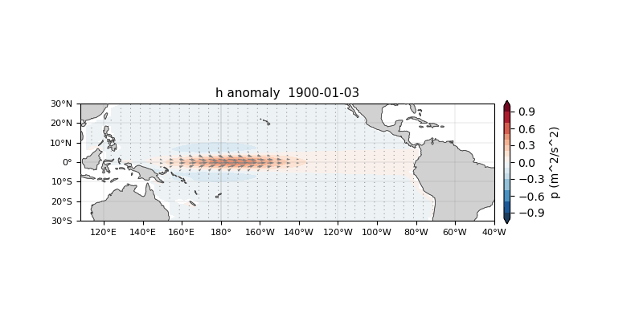
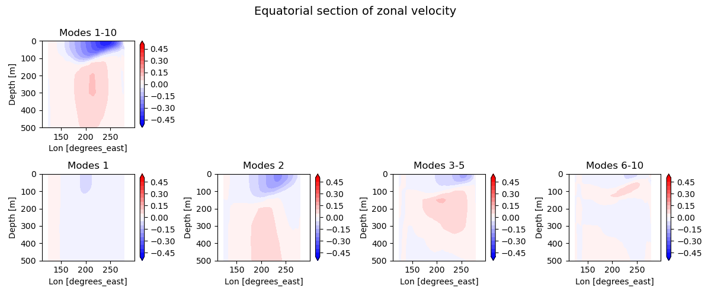

# LCSM
This is a series of Fortran source codes of the linear continuously stratified ocean model (LCSM; McCreary et al. 1981) and associated preprocessing/postprocessing tools written by S. Kido. 

Using wind forcing, the background wind projection coefficient, and phase speed of baroclinic modes,the model calculate velocity and density/pressure field.

 When you use these codes in your publications, please cite Kido et al. (2019) in your reference. If you have any questions or identify some bugs, please contact S. Kido (see below for the contact adress). 

## Overview
The repository provides one main executable:
-  `exec_solver_lcsm_dyn.out`: standalone ocean dynamical model forced by prescribed wind stress, the wind projection coefficients, and wave speeds of baroclinic modes.

## Example Visualization
- Animation map of simulated pressure and horizontal velocity fields for single baroclinic mode (and thus equivalent to the linear reduced-gravity wave model) in response to an equatorial wind patch.

- Depth-longitude section of simulated zonal velocity along the equatorial Pacific for the spin-up simulation forced by JRA55-do climatological forcing.


## Repository Structure

```text
CODES/
  Fortran source files, Makefile, and generated executables/modules after build.

Preprocessing/
  Tool for preprocessing files
  DATA/     Sample data for grid generation
  GRID/     Scripts for processing grid files and associated outputs    
  STRF/     Scripts for constructing stratification-related (wind projection coefficients, speed of baroclinic mode, and individual modal functions) files and associated outputs    
  WIND/     Scripts for creating wind forcing files and associated outputs
RUN/
  Example namelist files for model execution.
OUTPUTS/
  Example or generated NetCDF outputs, organized by model component.

GALLERY/
  Plotting notebooks and example figures.
```

## Requirements

Confirmed from the repository:

- A Fortran compiler. The provided `CODES/Makefile` uses `gfortran`.
- NetCDF C and NetCDF Fortran libraries. The Makefile links with
  `-lnetcdf -lnetcdff`.
- Lapack Fortran libraries. This is necesarry for executing eigenmode analysis codes in STRF/
  `-llapack`.
- `make`.
- Python 3 for preprocessing and analysis scripts.
- Python packages used by scripts/notebooks are to be confirmed, but likely
  include `numpy`, `xarray`, `netCDF4`, `matplotlib`, and `jupyter`.

The Makefile currently contains local Homebrew paths such as:

```make
NETCDF_INCDIR=-I/opt/homebrew/Cellar/netcdf-fortran/4.6.1/include
NETCDF_LIBDIR=-L/opt/homebrew/Cellar/netcdf-fortran/4.6.1/lib -L/opt/homebrew/Cellar/netcdf/4.9.2_2/lib
```

These paths are machine-specific. New users will usually need to edit
`NETCDF_INCDIR` and `NETCDF_LIBDIR` for their environment.

## Example Workflow
### 1. Clone and enter the repository.
```bash
git clone https://github.com/shokido/LCSM
cd LCSM
```
### 2. Edit CODES/Makefile if NetCDF include/library paths differ.
```bash
cd CODES
make -f Makefile
```
### 3. Run the shallow-water single mode example.
```bash
cd ..
mkdir -p OUTPUTS/
cd RUN/
../CODES/exec_solver_lcsm_dyn.out < test_eqpac30_eqpatch_sw.nml
```

## Governing equations
### Original equation
```math
\frac{\partial u}{\partial t}=-\frac{1}{\rho_{0}}\frac{\partial p}{\partial x}+fv+\nu_{h}\nabla^{2}u+\frac{\partial }{\partial z} (\nu_{v}\frac{\partial u}{\partial z} )+F_x
```
```math
\frac{\partial v}{\partial t}=-\frac{1}{\rho_{0}}\frac{\partial p}{\partial y}-fu+\nu_{h}\nabla^{2}v+\frac{\partial }{\partial z} (\nu_{v}\frac{\partial v}{\partial z} )+F_y
```
```math
\frac{\partial p}{\partial z}=-\rho g
```
```math
\frac{\partial \rho}{\partial t}=\rho_{0}\frac{N^{2}}{g}+\frac{\partial^{2} }{\partial z^{2}} (\kappa_{v}\rho)
```
```math
\frac{\partial u}{\partial x}+\frac{\partial v}{\partial y}+\frac{\partial w}{\partial z}=0
```
,where $(u,v,w)$ denotes the zonal, meridional, and vertical velocity, respectively, $p$ is the pressure,  $\rho$ is the density, $f$ is the Coriolis parameter, $g$ (=9.8 [m/s^2]) is the gravitational acceleration, $\rho_{0}$  (=1024 [kg/m^3]) is the reference density,$N^{2}=-\frac{g}{\rho_{0}}\frac{d\bar{\rho}}{dz}$ is the squared buoyancy frequency with the background density $\bar{\rho}$, $\nu_{h},\nu_{v}$ are the horizontal and vertical viscosity coefficients, respectively, and $\kappa_{v}$ is the vertical diffusion coefficient. Also, $F_x$ and $F_{y}$ are zonal and bottom drag force, which represent the wind forcing.
 These equations are subject to the following boundary conditions at the sea surface and bottom:

```math
\nu_{v}\frac{\partial u}{\partial z}=\nu_{v}\frac{\partial v}{\partial z}=0 @ z=0and H
```
```math
\rho=w=0 @ z=0and H
```

 The modal functions at each grid point can be obtained by solving the following eigenvalue problem,
```math
\frac{d}{dz}(\frac{1}{N^{2}}\frac{d\psi_{n}}{dz})=-\frac{1}{c_{n}^2}\psi_{n}
```
with the boundary conditions
```math
\frac{d\psi_n}{dz}=0
```
at z=0 and z=-H.Here, c_n (x,y) and ψ_n (x,y,z) are the phase speed and vertical modal function of the n-th vertical baroclinic mode, respectively.Due to orthogonality of the vertical modal functions, each variable can be represented as 
```math
u=\sum_{n=1}^{N}u_{n}\psi_{n},v=\sum_{n=1}^{N}v_{n}\psi_{n},p=\sum_{n=1}^{N}\rho_{0}p_{n}\psi_{n}
```
```math
w=\sum_{n=1}^{N}w_{n}\int_{z=-H}^{z}\psi_{n},\rho=\sum_{n=1}^{N}\rho_{0}\rho_{n}\frac{d\psi_{n}}{dz}
```
Using these equations, and assuming that the values of vertical viscosity and diffusion coefficients are equal and inversely proportional to the squared buoyancy frequency,
```math
\nu_{v}=\kappa_{v}=\frac{A}{N^{2}}
```
 we obtain equations for expansion coefficients: 
### Equations for each baroclinic mode (n)
```math
(\frac{\partial}{\partial t}+\frac{A}{c_{n}^{2}})u_{n}=-\frac{\partial p_n}{\partial x}+fv_{n}+\nu_{h}\nabla^{2}u_{n}+b_{n}\frac{\tau_x}{\rho_0} 
```
```math
(\frac{\partial}{\partial t}+\frac{A}{c_{n}^{2}})v_{n}=-\frac{\partial p_n}{\partial y}-fu_{n}+\nu_{h}\nabla^{2}v_{n}+b_{n}\frac{\tau_y}{\rho_0}　 \
```
```math
(\frac{\partial}{\partial t}+\frac{A}{c_{n}^{2}})p_{n}=-c_{n}^{2}(\frac{\partial u_{n}}{\partial x}+\frac{\partial v_{n}}{\partial y})
```
with 
```math
b_{n}=\frac{\int_{-H}^{0}F(z)\psi_{n}dz}{\int_{-H}^{0}\psi_{n}^{2}dz}
```
### Use of LSCM as a 1.5 layer shallow-water model
The governing equations of the shallow-water model equation are written as follows:
```math
\frac{\partial u_{SW}}{\partial t}=-g'\frac{\partial h_{SW}}{\partial x}+fv_{SW}-ru_{SW}+\nu_{h}\nabla^{2}u_{SW}+\frac{\tau_{x}}{\rho_{0}H}
```
```math
\frac{\partial v_{SW}}{\partial t}=-g'\frac{\partial h_{SW}}{\partial y}-fu_{SW}-rv_{SW}+\nu_{h}\nabla^{2}v_{SW}+\frac{\tau_{y}}{\rho_{0}H}
```
```math
\frac{\partial h_{SW}}{\partial t}=-H(\frac{\partial u_{SW}}{\partial x}+\frac{\partial v_{SW}}{\partial y})-rh_{SW}
```
Therefore, if we set $n=1$ and $c_{1}^{2}=g'H, A=rc_{n}^{2}$, and $b_1=\frac{1}{H}$, we recover the shallow water system.
## References
・McCreary, J. P. (1981). A linear stratified ocean model of the coastal undercurrent. Philosophical Transactions of the Royal Society A:
Mathematical, Physical and Engineering Sciences, 302(1469), 385–413. 
https://doi.org/10.1098/rsta.1981.0176

・Kido, S., T. Tozuka, and W. Han, "Experimental assessments on impacts of salinity anomalies on the positive Indian Ocean Dipole"
Journal of Geophysical Research Oceans, 124, 9462-9486, 2019.
https://agupubs.onlinelibrary.wiley.com/doi/abs/10.1029/2019JC015479

・Kusunoki, H., Kido, S., & Tozuka, T. (2021). Air-sea interaction in the western tropical Pacific and its impact on asymmetry of the Ningaloo Niño/Niña. Geophysical Research Letters, 48, e2021GL093370. https://doi.org/10.1029/2021GL093370

## Contact
・Shoichiro Kido (JAMSTEC, Application laboratory, Japan)

E-mail: skido (at) jamstec.go.jp (replace "at" with @)
